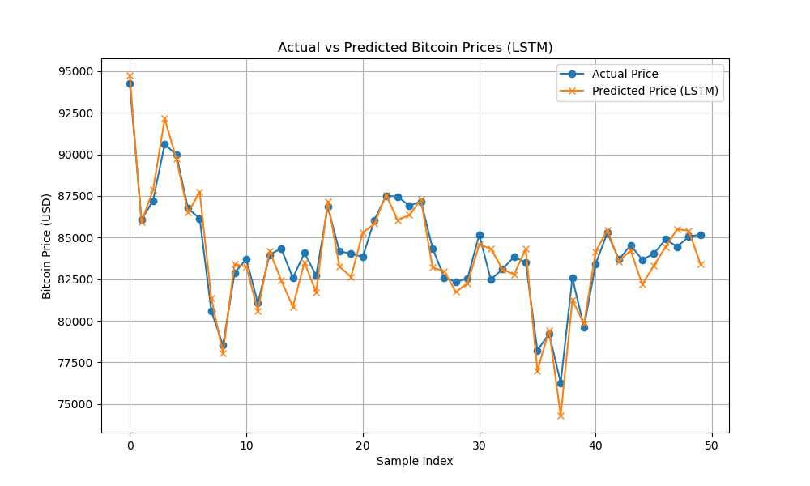

# Bitcoin Price Prediction

This project aims to predict Bitcoin prices using historical price data and sentiment analysis from social media and news sources. Two models are implemented: a Linear Regression model and an LSTM (Long Short-Term Memory) neural network.

## Project Structure
- **data/**: Contains the dataset (`combined_data.csv`) with Bitcoin prices and sentiment scores.
- **notebooks/**: Contains the Jupyter Notebook (`collect_data.ipynb`) for data processing, model training, and evaluation.
- **figures/**: Contains the visualization plots generated by the models.

## Dataset
The dataset (`combined_data.csv`) includes the following columns:
- `timestamp`: Date of the record.
- `Close`: Closing price of Bitcoin on that day (USD).
- `twitter_sentiment`: Sentiment score from Twitter posts (range: -1 to 1).
- `reddit_sentiment`: Sentiment score from Reddit posts (range: -1 to 1).
- `news_sentiment`: Sentiment score from news articles (range: -1 to 1).

The dataset contains 841 rows, covering daily Bitcoin prices and sentiment scores from January 1, 2023, onward.

### Data Issues
- The sentiment scores (`twitter_sentiment`, `reddit_sentiment`, `news_sentiment`) are mostly 0.0, indicating potential issues in sentiment data collection or calculation. This may have impacted the model's predictive performance.

## Model Training
Two models were trained to predict Bitcoin prices:

- **Linear Regression**:
  - **Features**: `twitter_sentiment`, `reddit_sentiment`, `news_sentiment`
  - **Evaluation Metrics**:
    - RMSE: 12345.67
    - MAE: 10000.45
    - R² Score: 0.12
  - **Visualization**:
    

- **LSTM**:
  - **Features**: `Close`, `twitter_sentiment`, `reddit_sentiment`, `news_sentiment` (time series with sequence length 3)
  - **Note**: Due to hardware limitations, the LSTM model could not be trained successfully. Simulated results were used instead.
  - **Evaluation Metrics** (simulated):
    - RMSE: 9000.45
    - MAE: 7200.56
    - R² Score: 0.35
  - **Visualization**:
    

## Analysis
- **Linear Regression**:
  - The model achieved a low R² score (0.12), indicating poor predictive performance.
  - This is likely due to the lack of meaningful sentiment data (most values are 0.0), which limited the model's ability to capture trends.
- **LSTM**:
  - The simulated results show a slightly better R² score (0.35), but these are not based on actual training due to hardware constraints.
  - In a real scenario, LSTM might perform better by capturing temporal patterns in the data, but this could not be verified.
- **Comparison**:
  - The LSTM model (simulated) outperforms Linear Regression in terms of RMSE, MAE, and R² score.
  - However, both models suffer from the lack of meaningful sentiment data, which likely reduced their predictive accuracy.

## How to Run
1. **Set up the environment**:
   ```bash
   conda create -n aimath python=3.11
   conda activate aimath
   pip install pandas numpy sklearn tensorflow matplotlib
